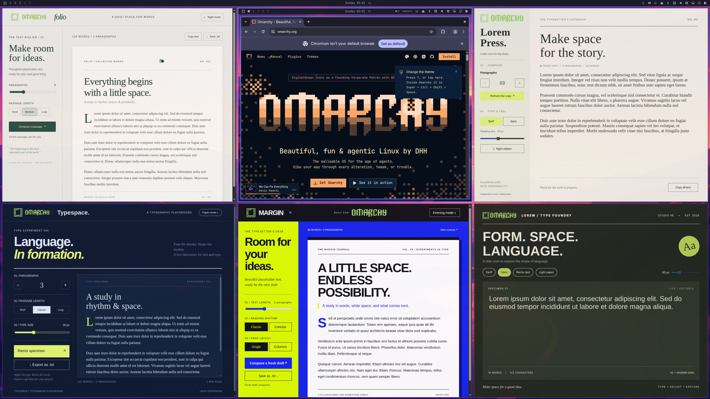

# omadev

Run Omarchy sessions as windows inside the one you are using. No VM, no
reboot, no `omarchy dev link`: each nest is a nested Hyprland with its own
omarchy-shell, pointed at whatever Omarchy source tree you choose. Up to nine
run side by side in slots 1-9, each with its own checkout if you like.

Because it is the same kernel and the same user, plugins in the nest see the
real hardware: `/sys/class/power_supply`, RAPL power limits, the DDC i2c bus,
hwmon, the system bus. Only the compositor and the session bus are separate.



*Six sessions on the `omadev` workspace, each a full Omarchy with its own bar; the middle one is capturing keys.*

## Install

```bash
curl -fsSL https://raw.githubusercontent.com/llstrk/omadev/main/install.sh | bash
omarchy restart shell
```

Or clone and run `./install.sh`. It links `omadev` into `~/.local/bin`, copies
the bar widget into `~/.config/omarchy/plugins` and enables it, appends the two
host bindings below to `~/.config/hypr/bindings.lua`, and links the agent
skill into `~/.claude/skills`, `~/.codex/skills` and `~/.agents/skills` where
those exist. Nothing needs root. Running it again updates a curl-installed
copy in `~/.local/share/omadev`.

The bindings the installer appends to `~/.config/hypr/bindings.lua`:

```lua
o.bind("SUPER + ALT + D", "Omadev sessions", "omarchy-shell dry.omadev toggle")
o.bind("SUPER + SHIFT + ALT + D", "Capture keys for the focused omadev session", "env OMADEV_ALLOW_CAPTURE=1 omadev focus")
hl.define_submap("nested", function()
  hl.bind("SUPER + SHIFT + ALT + D", hl.dsp.submap("reset"), { description = "Release keys from the omadev session" })
end)
```

The bar widget `dry.omadev` (in `plugin/`) is the visual side. It must be a
real directory under `~/.config/omarchy/plugins`: the shell watches that tree
with `inotifywait -r`, which does not descend into symlinked directories, so a
symlinked plugin never hot-reloads. (In this checkout `plugin/dry.omadev` is a
symlink the other way, to the live copy.) On the host it is one icon,
lit while sessions run, that opens a panel of the open sessions: a row per
session with focus-and-capture and stop actions, and a + button that
starts a new session in the first free slot. The panel takes the keyboard:
j/k move, Enter focuses and captures, n starts a session, d (or x) stops the
selected one, w goes to the omadev workspace, Esc closes. It also closes
when it loses keyboard focus, for instance on a workspace switch, except
right after n: a session's window mapping makes the compositor take focus
away for a moment, and the panel takes it back, whoever started the session. Inside a session it shows
whether the host is passing keys there and releases them on click; while
keys are captured a small box under the widget says how to release them. That label
shrinks with the session's width so the bar's centre block does not run into
it when the window is tiled narrow: full text, then a single word, then only
the icon and slot number (the red highlight still shows capture). The two
thresholds are widget settings, `compactBelow` (1300) and `iconOnlyBelow` (900). A new
plugin id needs one `omarchy restart shell` before the bar picks it up.

A new session's window opens on the host workspace named `omadev`, shared by
all sessions, without switching to it or taking focus from what you were
doing. The launcher installs a window rule for that into the running host
compositor (class `aquamarine`, floating, no initial focus, silent workspace)
through `hyprctl eval`; nothing is written to your Hyprland config, and a
host `hyprctl reload` drops the rule until the next start re-adds it. There the sessions are laid out as an even grid of
floating windows, recomputed whenever one starts or stops (dwindle would keep
halving whichever window was focused last). Press w in the sessions panel to go to that workspace,
or jump to one session from its row or with `omadev focus N`; drag it back
into a tiled layout whenever you like. `--place tile` (or `OMADEV_PLACE=tile`)
leaves the window where the host's layout puts it instead.

Closing a session's window on the host ends the session: the launcher watches
for its window and asks the nested compositor to exit when it is gone, since
Hyprland itself keeps running without an output.

## Use

```bash
omadev                                  # lowest free slot, installed /usr/share/omarchy
omadev start 2 --path ~/Projects/omarchy   # slot 2 runs a checkout
omadev --scale 1.25                     # HiDPI nest; the size always follows the window
omadev --no-shell                       # compositor only
omadev list                             # the nine slots
omadev start --detach                   # return once the nest's shell answers (start otherwise blocks)
omadev log 2 -f                         # follow nest 2's shell and app output (not the compositor's)
```

`start` without `--detach` stays in the foreground for the life of the nest,
like running Hyprland by hand; Ctrl-C ends it. Use `--detach` from scripts and
agents. `omarchy nested ...` is not routed by the Omarchy CLI, which only
discovers commands in its own bin directory; call `omadev` directly.

Super+Alt+D opens the sessions panel; each row focuses its nest and captures
keys for it. Super+Shift+Alt+D toggles capture
for whatever nest is focused; the keyboard icon on a panel row does the same.
Capture is for the person at the keyboard: `omadev focus` refuses unless
`OMADEV_ALLOW_CAPTURE=1` is set, which only the binding and the widget do, and
the widget offers no capture over IPC, so a script or agent cannot take your
keyboard. Ctrl-C in the launching terminal or `omadev stop N` ends a
nest; `omadev stop all` ends every nest. `stop` waits until the slot
is free (up to 15 s; `--kill` then sends SIGTERM to a compositor that ignores
the exit request). `list` shows a nest as `stopping` in between. Each slot's
launcher.log stays under the runtime directory for post-mortems.

Starting several nests at once is safe: a slot is claimed atomically (a lock
file holding the launcher's PID) before anything is launched, so concurrent
starts without a slot number get distinct slots and two starts of the same
number leave one of them refused.

The nested compositor occasionally stalls in its handshake with the host
(its log stops while listing buffer formats, it never gets an output, and
nothing inside starts). The launcher treats a nest that has not published
its record within 15 s as stalled, kills that compositor tree and launches
again, up to three times, so a start either yields a working nest or fails
loudly; it never leaves a headless compositor behind.

A slot is alive when its compositor socket (`$XDG_RUNTIME_DIR/hypr/<sig>/`)
accepts a connection; the recorded PID is only a fallback. A session record
that can be neither reached nor verified, as inside an agent sandbox with its own PID
namespace or without the runtime directory, lists as `unreachable` rather than
`free`, and only the launcher that wrote a record ever removes it.

From any host terminal you can drive a nest without focusing it. The slot
number is optional when only one nest runs or when you are inside one:

```bash
omadev run 2 omarchy restart shell      # restart only nest 2's shell
omadev shell 2 shell listPlugins        # omarchy-shell IPC in nest 2
omadev hyprctl 2 clients                # hyprctl against nest 2
omadev hyprctl 2 dispatch 'hl.dsp.exec_cmd("ghostty")'
omadev run 2 wtype "text"               # type into the focused app (compositor binds do not fire)
omadev list --json                      # every nest's environment, owner, pid
OMADEV_ALLOW_CAPTURE=1 omadev focus 2   # focus nest 2 and capture keys (user-only guard); no number: the focused nest
```

Nested-only Hyprland config goes in `~/.config/hypr/omadev.lua`; it is loaded
after your normal config, only in the nest.

## Every nest has its own home

A nest never shares Omarchy config with the host or with other nests. Its
home under `~/.local/state/omadev/N/home` is a directory of symlinks to the
real home, except:

- `~/.config/omarchy` and `~/.local/state/omarchy`, which are reflink clones
  (btrfs copy-on-write: instant, and no blocks of their own until a file is
  written). shell.json, plugins, themes and toggles in the nest are the nest's.
- Chromium-family browser profiles (`~/.config/chromium` and friends), which
  start empty: those browsers are single-instance per profile, so through a
  linked profile a browser started in the nest would just open a window in
  the one already running on the host.

Everything else, projects, keys, app configs, is the real file.

```bash
omadev start 3 --detach --plugin ~/worktrees/dell-monitor-fix
omadev run 3 omarchy plugin enable dry.dell-monitor   # only nest 3's shell.json changes
omadev diff 3                                          # what the nest changed
omadev stop 3 && omadev clean 3                        # the home is kept until clean
```

`--plugin <dir>` links a checkout, typically a git worktree, into the nest's
plugins directory under its manifest id, so each teammate works on its own
branch and the orchestrator merges branches instead of copying files. It also
works through `ensure` on a running nest. `--reuse` keeps the previous home of
a slot instead of cloning a fresh one. `diff` excludes linked checkouts (use
git there) and churny state such as clipboard history.

## For agents and orchestrators

`skill/SKILL.md` (linked into the agent skill directories by the installer) is
the agent-facing guide. The commands built for it:

```bash
omadev ensure 3 --owner teammate-1 --plugin ~/wt/fix   # idempotent claim, waits for the shell, JSON out
omadev list --json                                            # slots, owners, pids, paths, environments
omadev screenshot 3 [file]                                    # grim inside the nest
omadev run 3 wtype "text"                                     # into the focused app, no host focus needed
omadev hyprctl 3 dispatch 'hl.dsp.exec_cmd("ghostty")'        # compositor-level actions
```

## What is shared and what is not

| | Nest |
|---|---|
| `~/.config/omarchy` (shell.json, plugins, themes, current theme) | private reflink clone per nest |
| `~/.config/hypr/*.lua` | shared; `monitors.lua` rules do not match the nested output |
| Hardware via sysfs, hwmon, i2c, system bus | shared, real values |
| `OMARCHY_PATH` | the nest's own (`--path`) |
| Compositor, Wayland socket, Hyprland instance | separate |
| Session bus (notifications, tray, MPRIS) | private to the nest by default |
| systemd user units, portals, fcitx5, polkit agent | host only |

## How it stays out of the host's way

- **Autostart.** Omarchy's session autostart is skipped in the nest. It would
  import the nest's `WAYLAND_DISPLAY` into the systemd user manager, start a
  second udiskie and reset power profiles. The nest runs only the shell, an
  idle inhibitor and a small script that publishes its environment.
- **`omarchy restart shell`.** The stock command takes the host's `OMARCHY_PATH`
  from the systemd environment and kills every quickshell running that config
  on any display, which is the host bar. `libexec/overlay/` shadows it with a
  version that only touches the nest's display.
- **`uwsm-app`.** The real one hands commands to `wayland-wm-app-daemon`, which
  spawns them with the host's environment, so SUPER+Return would open a
  terminal on the host. The overlay runs the command directly instead.
- **Idle and lock.** A small Quickshell "keeper" in each nest holds a Wayland
  idle inhibitor, so the nested shell never starts its screensaver or lock
  and never competes with the host lock for the fingerprint reader.
  Disabling idle through the shell would write the shared stay-awake file
  and switch the host's idle off too. `--idle` turns the inhibitor off.
- **Window size.** The nested output follows the host window. Hyprland's
  Wayland backend resizes the output, but the compositor neither re-arranges
  its layers and windows nor tells clients about the new mode until the
  monitor rule is re-applied. The keeper polls the output size twice a second
  and re-applies the rule on a change, so bar, background and windows follow
  within about a second. There is no fixed-size mode.
- **Logs.** The `systemd-cat` shim retags the nested shell's journal output
  as `omadev-N`, so `omadev log N` reads one nest without
  PID archaeology. The compositor's own log stays in its runtime directory.
- **Session bus.** `dbus-run-session` gives the nest a private bus so the
  nested shell can own `org.freedesktop.Notifications`. The bus uses a
  generated config whose service directory omits the portal and at-spi
  services: the Hyprland portal segfaults against a nested compositor and
  at-spi loops without systemd, and the host provides both anyway. The
  activation environment is pointed at the nest, so anything else it
  activates connects to the nested compositor.

## Limits

- The nested compositor has no DRM outputs. Monitor hotplug, DPMS, lid
  handling, hyprsunset and clamshell logic cannot be tested here.
- Anything that writes hardware state writes the real hardware. Keep write
  paths behind a dry-run flag while iterating.
- Commands that touch systemd user units or the package system (`omarchy
  update`, `omarchy dev link`) act on the host. Do not run them in the nest.
- Screenshots inside the nest only complete while the host actually shows the
  window; `grim` blocks otherwise.
- Every nest logs a few warnings because the host already owns the
  session-wide service: portal app-ID registration, the polkit agent, at-spi,
  and Quickshell's duplicate-IPC-handler notice for user plugins.
  `omadev log N` hides them; `--all` shows them.
- No portals inside a nest: portal file dialogs and screen sharing fall back
  or fail there. Apps still run; grim screenshots still work.
- The host tray does not show apps running in the nest, and host notifications
  do not appear in the nest.
- Nine slots, each with its own copy of `~/.config/omarchy`: a host plugin
  edit reaches a nest only when the nest is restarted (or the plugin is linked).
- The host cannot tell nest windows apart by title; the widget and the
  `focus` command find them by the compositor's PID.

## Layout

```
bin/omadev                 launcher and every control command (Python 3, standard library only);
                                   its hidden `_publish` runs inside the nest on start to record the environment
libexec/hyprland.lua               nested Hyprland config (wraps your real hyprland.lua)
libexec/overlay/                   PATH shims (bash, tiny exec wrappers): omarchy, omarchy-restart-shell, uwsm-app, systemd-cat
libexec/keeper/shell.qml           per-nest helper: idle inhibitor + follow-the-window resize
```
